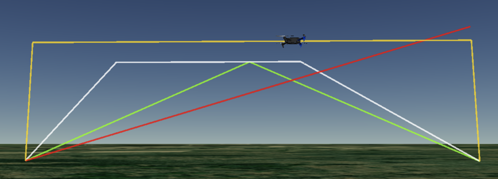

## SUPPLEMENT TO
# VeRoViz: A Vehicle Routing Visualization Toolkit

This document provides additional details, via an example, of the VeRoViz package described in the paper titled "VeRoViz: A Vehicle Routing Visualization Toolkit."   This example was too lengthy to include in the paper itself.

Section 1 contains code describing some of the more commonly-used VeRoViz Python functions.  This includes the functionality to generate nodes (sample problems), obtain travel time and distance matrices, visualize vehicle routes on two-dimensional maps, and create three-dimensional "movies" of vehicle routing solutions.  
Section 2 describes some of VeRoViz's "utility" functions. 

A Python Jupyter notebook, allowing readers to run the code described below, is available at https://veroviz.org/documentation.html.

---


## 1. Demonstration

This section demonstrates several VeRoViz functions via a simple vehicle routing example involving a truck and a drone in a last-mile delivery problem.
The demonstration begins by creating a test problem and continues through displaying a solution.

### 1.1 Generate nodes

Our first task is to define the locations of a depot (where the truck and drone will originate) and the customers.
These specific locations could be easily selected in Sketch, or they could be imported from existing data.
However, this example demonstrates how to programmatically generate test problems (via Python).

We begin by defining regions where the depot and customer nodes will be generated.  In this example, the depot will be located within some polygon, which we drew in Sketch and exported to Python. 
The customers will be normally distributed around Amherst, NY, with a standard deviation of 1.5 miles.  The Python code for defining (and displaying) these geographic regions, using the `veroviz` package, is shown in Figure 1.

```python
import veroviz as vrv
```

```python
# Define a region within which the depot will be generated.  Coordinates were generated in Sketch:
depotRegion = [[42.99, -78.72], [42.96, -78.71], [42.97, -78.68], [43.01, -78.69]]

# Define a center point for customers.  The geocode() function returns [lat, lon] coordinates.
amherst = vrv.geocode('Amherst, NY')

# Define a radius for 1 standard deviation, in units of meters
radiusMeters = vrv.convertDistance(1.5, 'miles', 'meters')
```

```python
# Draw the depot region polygon, and add a text label:
myMap = vrv.createLeaflet(boundingRegion = depotRegion)
myMap = vrv.addLeafletText(mapObject = myMap, text = 'Depot Region', fontColor = 'black',
                           anchorPoint = depotRegion[3])

# Draw the customer region with circles, and label according to standard deviation:
myMap = vrv.addLeafletCircle(mapObject = myMap, center = amherst, 
                             radius = 3*radiusMeters, fillColor = 'red')
myMap = vrv.addLeafletText(mapObject = myMap, text = '3 std. devs.', fontColor = 'black',
                           anchorPoint = vrv.pointInDistance2D(amherst, 180, 3*radiusMeters))

myMap = vrv.addLeafletCircle(mapObject = myMap, center = amherst,
                             radius = 1*radiusMeters, fillColor = 'blue')
myMap = vrv.addLeafletText(mapObject = myMap, text = '1 std. dev.', fontColor = 'black',
                           anchorPoint = vrv.pointInDistance2D(amherst, 180, radiusMeters))

myMap
```

|  | 
|:--:| 
| *Figure 1: Defining the regions for the depot and customer locations.* |


Next, we generate the nodes from the defined regions, including one depot (node 0) and five customers (nodes 1--5).  
The `generateNodes()` function produces a VeRoViz "nodes" dataframe, which contains information about the location of each node, as well as names, and formatting for the appearance of the nodes on a map. 

VeRoViz can generate nodes from three different types of distributions:  uniformly distributed within a bounding region, normally distributed, or normally distributed and bounded within a polygon.  
All of the nodes in this example are snapped to the road network, the data for which is provided (in this case) by the "OSRM-online" data provider.  Code for generating and displaying the nodes for our example is shown in Figure 2.

 
```python
# Generate a depot within the polygon boundary
myNodes = vrv.generateNodes(numNodes = 1, startNode = 0, nodeType = 'depot', snapToRoad = True,
                            nodeDistrib = 'uniformBB', dataProvider = 'OSRM-online',
                            nodeDistribArgs = {'boundingRegion': depotRegion})
```

```python
# Also generate 5 customer nodes, normally distributed, with custom circle markers
myNodes = vrv.generateNodes(initNodes = myNodes, numNodes = 5, startNode = 1,
                            nodeType = 'customer', snapToRoad = True,
                            leafletIconPrefix = 'custom', leafletIconType = '12-white-12',
                            leafletColor = 'green', nodeDistrib = 'normal', dataProvider = 'OSRM-online',
                            nodeDistribArgs = {'center': amherst, 'stdDev': radiusMeters})
```

```python
myNodes    # Display nodes dataframe
```

|  id | lat | lon | altMeters | nodeName | nodeType | popupText | leafletIconPrefix | leafletIconType | leafletColor | leafletIconText | ... |
| --- | --- | --- | --------- | -------- | -------- | --------- | ----------------- | --------------- | ------------ | --------------- | --- |
| 0 |  43.003922 | -78.697982 |        0.0 |    Depot |     depot |          0 |         glyphicon |       info-sign |         blue |                0 | ... |
| 1 |  42.951958 | -78.795942 |        0.0 |  Cust. 1 |  customer |          1 |            custom |     12-white-12 |        green |                1 | ... |
| 2 |  42.974264 | -78.820277 |        0.0 |  Cust. 2 |  customer |          2 |            custom |     12-white-12 |        green |                2 | ... |
| 3 |  42.974697 | -78.798269 |        0.0 |  Cust. 3 |  customer |          3 |            custom |     12-white-12 |        green |                3 | ... |
| 4 |  42.998253 | -78.794730 |        0.0 |  Cust. 4 |  customer |          4 |            custom |     12-white-12 |        green |                4 | ... |
| 5 |  42.993819 | -78.802980 |        0.0 |  Cust. 5 |  customer |          5 |            custom |     12-white-12 |        green |                5 | ... |


```python
vrv.createLeaflet(mapObject = myMap, nodes = myNodes)    # Add nodes to previous map
```

|  | 
|:--:| 
| *Figure 2: Generate nodes from a polygon region (for the depot) and according to a normal distribution (for the customers).* |


### 1.2 Travel time and distance matrices
Before solving our routing problem, we want to know the distances between all pairs of nodes.  
VeRoViz provides the `getTimeDist2D()` function to capture matrices for ground-based (2-dimensional) travel time and distance between nodes. In this example, we seek these values based on the fastest time between nodes; alternatively, we could make the request based on the shortest distance.  Available route type options for each data provider are given in Table 1.

| *Table 1: Data providers used in VeRoViz* |
|:--:| 
|  | 
 

For the drone in our example, we use the `getTimeDist3D()` function, with the default "square" profile (i.e., the drone takes off and lands vertically).  Other flight profiles are shown in Figure 3.  Currently, VeRoViz determines the times and distances based on simple geometries, ignoring obstacles, terrain, or no-fly zones.
Since the drone in this problem only travels between the depot and a single customer at a time, a one-to-many distance matrix (i.e., a single row of generated data) is sufficient.  In this example, the total travel time from the depot to customer 4 is given by `timeSecUAV[0,4] = 514.16` seconds.

|  | 
|:--:| 
| *Figure 3: Available drone flight profiles include "square" (yellow), "trapezoidal" (white), "triangular" (green) and "straight" (red).* |


Code for generating the travel matrices for the truck and drone is presented below:

```python
# Travel Matrices -- Truck
# Find truck's travel time (in seconds) and distance (in meters) between all pairs of nodes.
[timeSec, distMeters] = vrv.getTimeDist2D(nodes=myNodes, routeType='fastest', dataProvider='OSRM-online')
```

```python
vrv.convertMatricesDictionaryToDataframe(distMeters)    # Display as a matrix/table
```


```python
# Travel Matrices -- Drone
# We only need departures from the depot (the return trip will be assumed symmetric)
[timeSecUAV, groundDistUAV, totalDistUAV] = vrv.getTimeDist3D(
    nodes              = myNodes,  matrixType = 'one2many', fromNodeID = 0, 
    takeoffSpeedMPS    = vrv.convertSpeed(10, 'miles', 'hr', 'meters', 'sec'),
    cruiseSpeedMPS     = vrv.convertSpeed(40, 'miles', 'hr', 'meters', 'sec'),
    landSpeedMPS       = vrv.convertSpeed( 5, 'miles', 'hr', 'meters', 'sec'),
    cruiseAltMetersAGL = vrv.convertDistance(350, 'feet', 'meters'))
```

```python
vrv.convertMatricesDictionaryToDataframe(timeSecUAV)  # Display as a matrix/table
```


### 1.3 Generate a solution

The next step would typically be to solve the problem.  Because VeRoViz is *not a solver*, for demonstration purposes we will manually generate a solution that simply describes the sequence of node visits for both the truck and the drone (shown below).  In practice, this is the step where researchers would apply their own algorithms to generate a solution.  

```python
# We'll manually create a solution, as a sequence of node visits for each vehicle.
route = {}
route['drone'] = [0, 4, 0, 5, 0]
route['truck'] = [0, 3, 1, 2, 0]
```


### 1.4 Visualizing vehicle routes with simple arcs

With a solution to the problem in hand, it is often useful to visualize the vehicle routes on a map.  
VeRoViz provides the `createArcsFromNodeSeq()` function to easily generate an "arcs" dataframe from a route defined by node visits.  The arcs dataframe contains information about the origin and destination of each route segment for each vehicle, but it does not include arrival or departure times.  Arcs dataframes are useful for simple graphics, where detailed turn-by-turn directions are not necessary; such details are more appropriately captured in "assignments" dataframes, as described in Section 1.5.

The arcs dataframe also captures the styling of the arcs (e.g., colors and line styles) to be displayed on a Leaflet map via the `createLeaflet()` function.  We use curved arcs for the drone to more easily observe the out-and-back routes. 
The resulting Leaflet map object is interactive; users may zoom in, or click on nodes and arcs to display additional information (e.g., node names or altitude) stored in the arcs dataframe.  The map may be also be saved as an HTML file for later use or sharing.  

The code for translating the solution to an arcs dataframe, and displaying the vehicle routes on a map, is shown in Figure 6.
Note that the truck visits 3 customer nodes, resulting in 4 arcs; the drone visits two customers, resulting in 4 arcs.


```python
# Convert the truck's route to an "arcs" dataframe:
myArcs = vrv.createArcsFromNodeSeq(nodeSeq = route['truck'], nodes = myNodes, objectID = 'Truck')
```

```python
# Convert the drone's route to an "arcs" dataframe, using dashed curved arcs:
myArcs = vrv.createArcsFromNodeSeq(initArcs = myArcs,  nodeSeq = route['drone'], nodes = myNodes,
                                   objectID = 'Drone', leafletColor = 'blue', leafletStyle = 'dotted',
                                   leafletCurveType = 'bezier', leafletCurvature = 8, cesiumColor = 'blue')
```

```python
myArcs    # Display contents of the arcs dataframe
```


```python
vrv.createLeaflet(nodes = myNodes, arcs = myArcs)
```

|  | 
|:--:| 
| *Figure 6: Creating an arcs dataframe from a sequence of node visits (i.e., a route).  The resulting arcs dataframe can be displayed in a Leaflet map.* |


### 1.5 Visualizing routes with detailed assignments dataframes}

While the "arcs" dataframe is sufficient for simple straight-line connections between nodes, the VeRoViz "assignments" dataframe holds detailed time-based turn-by-turn routing information on road networks.  
These routes may be visualized on a static map using the \texttt{createLeaflet()} function.  However, the additional details contained in the assignments dataframe (including 3D models of vehicles) allow the generation of time-dynamic 3D movies in Cesium.  
Assignments dataframes also allow representation of static objects, such as vehicles that are stationary during a service stop or even packages that are delivered.

The process of generating the assignments dataframe associated with the solution to our test problem is described in the code block below.  For the truck, we employ the `createAssignmentsFromArcs2D()` function to easily extend our previously-created arcs dataframe into an assignments dataframe.  We have added a 30-second service time at each node.  The resulting assignments dataframe will contain the turn-by-turn routing on the road network.
For the drone, we wish to differentiate the segments of the route where the drone is carrying a parcel.  We will iteratively call the `addAssignment3D()` function for each origin-destination pair.  

VeRoViz provides several other functions to help the user create a new `assignments`
dataframe, or append routes into an existing `assignments` dataframe. These are documented at https://veroviz.org/docs/veroviz.createAssignments.html.

```python
# Turn-by-turn road network travel for the truck:
myAssignments = vrv.createAssignmentsFromArcs2D(arcs = myArcs[myArcs['objectID'] == 'Truck'],
                                                modelFile = 'veroviz/models/ub_truck.gltf',
                                                routeType = 'fastest', dataProvider = 'OSRM-online',
                                                serviceTimeSec = 30, ganttColor = 'orange')
```

```python
# Create assignments for the drone:
endTimeSec = 0.0
i = route['drone'][0]
for j in route['drone'][1:]:
    model = 'drone_package.gltf' if (myNodes['nodeType'][i] == 'depot') else 'drone.gltf'

    [myAssignments, endTimeSec] = vrv.addAssignment3D(
        initAssignments    = myAssignments,     objectID = 'Drone',
        modelFile          = 'veroviz/models/' + model,
        startLoc           = list(myNodes[myNodes['id'] == i][['lat', 'lon']].values[0]),
        endLoc             = list(myNodes[myNodes['id'] == j][['lat', 'lon']].values[0]),
        startTimeSec       = endTimeSec,
        takeoffSpeedMPS    = vrv.convertSpeed(10, 'miles', 'hr', 'meters', 'sec'),
        cruiseSpeedMPS     = vrv.convertSpeed(40, 'miles', 'hr', 'meters', 'sec'),
        landSpeedMPS       = vrv.convertSpeed( 5, 'miles', 'hr', 'meters', 'sec'),
        cruiseAltMetersAGL = vrv.convertDistance(350, 'feet', 'meters'),
        leafletColor       = 'blue',      leafletStyle     = 'dotted',
        leafletCurveType   = 'bezier',    leafletCurvature = 2,        cesiumColor = 'blue')

    i = j
```


Figure 8 shows the resulting assignments dataframe.  The `odID` column provides a unique identifier for each origin-destination (OD) pair.  For the truck, a given OD pair will contain numerous individual straight-line segments (so-called "shapepoints") comprising the route on the road network.  For the drone, the OD pair is decomposed into the different flight phases (e.g., vertical takeoff to altitude, cruising at altitude, and vertical landing).  The assignments dataframe can be visualized as a Leaflet map, where the road-based route of the truck is observed.


```python
myAssignments
```


```python
vrv.createLeaflet(nodes = myNodes, arcs = myAssignments)
```

|  | 
|:--:| 
| *Figure 8: Viewing the resulting assignments dataframe, with a map visualization.* |


### 1.6 Visualizing 3D movies in Cesium
Perhaps the most novel and powerful feature of VeRoViz is the ability to easily generate 3D movies of vehicle routing problems.  
As shown in Figure 9, the `createCesium()` function simply requires the nodes and assignments dataframes, as well as the location where the Cesium application is installed and the name we wish to give our problem.  The VeRoViz Cesium plugin allows this content to be viewed in a web browser.  

```python
vrv.createCesium(assignments = myAssignments, nodes = myNodes,
                 cesiumDir = '/home/user/Cesium', problemDir= 'example')
```


|   | 
| :--: | 
| *Figure 9: The `createCesium()` function transforms nodes and assignments dataframes into interactive 3D visuals.  
This demo may be tested at https://veroviz.org/cesium_joc.html.* |


### 1.7 Visualizing solutions with Gantt charts

Gantt charts showing the timing of vehicle routes, from an assignments dataframe, may be generated with the `createGantt()` function.  Configuration options exist for adding labels, hiding/showing grid lines, and grouping vehicles.  Gantt charts can be exported as images.

```python
# Create (and save) a Gantt chart:
vrv.createGantt(assignments = myAssignments, title = 'Vehicle Travel', xAxisLabel = 'time [mm:ss]',
                xGridFreq = vrv.convertTime(10, 'min', 's'), timeFormat = 'MS',
                overlayColumn = 'odID', filename = 'myGantt.png')
```

|  | 
| :--: | 
| *Figure 10: A Gantt chart for the example problem, where numbers in the boxes are `odID` values from the assignments dataframe, describing the origin-destination pairs comprising each vehicle's route.* |


## 2 Utilities
VeRoViz features a large collection of "utility" functions, as described at https://veroviz.org/docs/veroviz.utilities.html.  This section provides an overview of some of these functions.

### 2.1 Isochrones

Isochrones are lines representing equal distance or travel time from (or to) a given point.  The VeRoViz `isochrones()` function makes it easy to obtain this data from the Open Route Service data provider.  Isochrones may be generated for various travel modes, including pedestrian, cycling, car, and heavy trucks.  The `addLeafletIsochrones()` function displays the resulting isochrones on a map, as shown in Figure 11.

Isochrone data can be leveraged in heuristics to determine if a destination is within reach.  This may be accomplished by combining the output from the `isochrones()` function with the `isPointInPoly()` utility function, which indicates if a given point is within a polyline.  This has the advantage of only requiring one call to an external data provider (i.e., obtaining the isochrones), rather than explicitly checking the distance or time required to travel between two specific points.

```python
iso = vrv.isochrones(location = vrv.geocode('Courthouse, Buffalo, NY'), locationType = 'start',
                     travelMode = 'foot-walking', rangeType = 'time',
                     rangeSize = vrv.convertTime(12, 'minutes', 'seconds'),
                     interval = vrv.convertTime(6, 'minutes', 'seconds'), smoothing = 15, 
                     dataProvider = 'ors-online', dataProviderArgs = {'APIkey': 'YOUR KEY'})
vrv.addLeafletIsochrones(iso=iso)                     
```

|  | 
| :--: | 
| *Figure 11: Isochrones* |


### 2.2 Weather
 Current and forecasted weather conditions -- including the probability of precipitation, wind speed and direction, and temperature -- can be important considerations in vehicle routing problems, particularly those involving aircraft.  The `getWeather()` function, shown in Figure 12, imports data from OpenWeatherMap.
         
```python
# Get weather data, saved as a dataframe:
weatherDF = vrv.getWeather(location = vrv.geocode('Buffalo, NY'),
                           dataProvider = 'openweather', dataProviderArgs = {'APIkey': 'YOUR KEY'})
```
```python
# Display current weather (subset of columns shown)
weatherDF[weatherDF['class']=='current'][['sunrise', 'sunset', 'temp', 'feels_like', 'clouds', 
                                          'weather_description', 'uvi', 'wind_speed', 'wind_deg']]
```


```python
# Daily forecast (subset of columns and rows shown)
# 'pop' --> probability of precipitation
weatherDF[weatherDF['class'] == 'daily'][['dt', 'weather_description', 'wind_speed', 'wind_deg', 
                                          'temp_min', 'temp_max', 'pop']].head()
```


| *Figure 12: A sample of available weather data.  Hourly forecasts (not displayed above) are also provided by the `getWeather()` function.* |


### 2.3 Elevation
For vehicle routing problems where elevation changes are important (e.g., electric vehicle routing, or problems seeking to minimize fuel consumption), VeRoViz provides the `getElevationDF()` function.  This function updates the elevation-related columns of nodes, arcs, and assignments dataframes, using data from a variety of sources.  Figure 13 provides an example using the U.S. Geological Survey (USGS) as a data provider; elevation data are also available from  Elevation-API and OpenRouteService.  

```python
# Replace missing start/end elevations in the arcs dataframe, using USGS data:
vrv.getElevationDF(dataframe = myArcs, dataProvider = 'usgs')
myArcs[['startLat', 'startLon', 'startElevMeters', 'endLat', 'endLon', 'endElevMeters']]
```


| *Figure 13: Updating an arcs dataframe with elevation data for the starting and ending locations of each arc.* |


### 2.4 Finding the nearest point along a path to a location}
The `closestPointLoc2Assignments()` function provides the GPS coordinates along a vehicle's route that is closest (in Euclidean distance) to a given location.  In other words, this function determines where a vehicle's route will pass nearest some location of interest, as shown in the example of Figure 14.
This function may be useful in the context of the *close-enough traveling salesman problem*, or in identifying how close a drone route would pass by a landmark.

```python
Buffalo_Airport = vrv.geocode('BUF')

closestPoints = vrv.closestPointLoc2Assignments(loc = Buffalo_Airport, assignments = myAssignments, 
                                                objectID = 'Truck')
closestPoints
```

```
{'Truck': [{'nearestPoint': [42.97795267257247, -78.72511011256127], 
              'distMeters': 4219.03371220169}]}
```  
```python
# Draw the routes and the point on the map:
myMap = vrv.createLeaflet(nodes = myNodes, arcs = myAssignments)
myMap = vrv.addLeafletMarker(mapObject = myMap, center = Buffalo_Airport, radius = 18,
                             text = 'BUF', fontColor = 'black', fontSize = 10)
myMap = vrv.addLeafletIcon(mapObject = myMap, location = closestPoints['Truck'][0]['nearestPoint'], 
                             iconType = 'star', iconColor = 'red')
myMap
```

|  | 
| :--: | 
| *Figure 14: The red starred marker identifies the point along the truck's route (orange) that is closest to the Buffalo airport (BUF).* |


### 2.5 Finding vehicle locations at a particular time
The `findLocsAtTime()` function returns the location of each vehicle at a given time.  
Such information is useful in coordinated vehicle routing, or in dynamic routing problems (e.g., dial-a-ride).  Additionally, this function can be employed within a discrete event simulation environment to track vehicle locations.  Figure 15 provides an example for the two-vehicle demonstration problem.  


```python
# Where are we 10 minutes into the route?
currentLocs = vrv.findLocsAtTime(
    assignments = myAssignments[myAssignments['objectID'].isin(['Drone', 'Truck'])], timeSec = 10*60)
currentLocs   # [lat, lon, altMeters] for each objectID
```

```
  {'Truck': [42.97807465673398, -78.76495422989909, 0.0],
   'Drone': [42.99905458805267, -78.78118391817928, 106.68]}
```

```python
myMap = vrv.createLeaflet(nodes = myNodes, arcs = myAssignments)
for objectID in ['Truck', 'Drone']:
    myMap = vrv.addLeafletIcon(mapObject = myMap, location = currentLocs[objectID], 
                               iconType = 'flag', iconColor = 'red')
myMap
```

|  | 
| :--: | 
| *Figure 15: The `findLocsAtTime()` function provides the GPS coordinates and altitude of each vehicle at a given time.  The red markers show the GPS locations for the drone and truck 10 minutes from their departures from the depot.* |

	